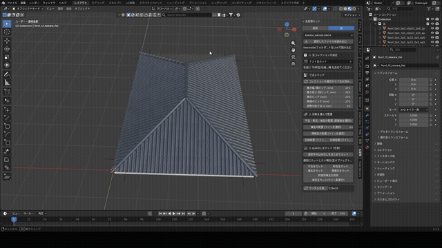

<h1 align="center">Hi 👋, I'm CERA</h1>
<h3 align="center">Blenderで住宅パースの作成を効率化するアドオンを開発しています</h3>

  
  
  

---

### 🏠 About

建築・住宅パース制作の現場向けに、Blenderの作業を効率化するアドオンを個人開発しています。
実案件で「あったら助かる」機能を、実際に使いながら育てています。

### 🛠️ 開放中のアドオン

#### [WafuRoofSet](https://github.com/cera3d/WafuRoofSet)

和瓦屋根の自動生成アドオン。屋根面や棟ラインを指定するだけで、瓦を自動配置。

  

  
  

### 📌 Pinned

  

---

<i>ご質問・不具合報告はリポジトリのIssueかXまでお気軽にどうぞ。</i>

